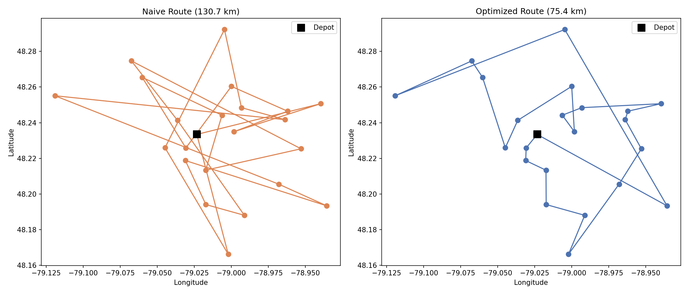

# Delivery Route Optimization

A Python model that replaces a naive, dispatcher-ordered delivery route with a nearest-neighbor optimized one — cutting total driving distance for a 22-stop delivery run.

## What it does

- **Real-world distance calculation** — uses the Haversine formula to calculate accurate distances between latitude/longitude coordinates (accounting for the Earth's curvature), rather than a flat straight-line approximation.
- **Naive route baseline** — measures total round-trip distance for 22 delivery stops visited in the order a dispatcher originally listed them.
- **Nearest-neighbor optimization** — a greedy algorithm that, from the current location, always travels to the closest unvisited stop next, until every delivery is complete and the route returns to the depot.
- **Before/after route visualization** — a side-by-side map of both routes, showing the naive route's excessive backtracking versus the optimized route's tighter path.

## Result

Across 22 delivery stops around Rouyn-Noranda, QC, the nearest-neighbor algorithm cut total route distance from **130.7 km to 75.4 km — a 42.3% reduction** — without changing which stops needed to be delivered, only the order they're visited in.

*Note: nearest-neighbor is a greedy heuristic — it only ever chooses the closest next stop, so it can occasionally leave a few awkward backtracks near the end of a route (visible as some crossing lines in the optimized map above). More advanced solvers (e.g., Google OR-Tools) can close that gap further by planning the full route ahead of time rather than one step at a time; nearest-neighbor was used here as the standard, fast first-pass approach used in real routing software.*

## Tools

Python (pandas for data handling, NumPy for the Haversine distance calculation, matplotlib for visualization), Google Colab / Jupyter Notebook.

## About the data

Delivery stops are synthetic but geographically realistic — 22 points scattered within an 8 km radius of a depot in Rouyn-Noranda, QC, the same city as my Delivery Associate role at Zino Transport, built to reflect the kind of last-mile routing problem a local delivery operation actually faces.

## Files

| File | Description |
|---|---|
| `delivery_route_optimization.ipynb` | The full analysis notebook — distance calculation, nearest-neighbor algorithm, and route comparison chart |
| `Delivery_Stops.csv` | Source data: 22 delivery stops with coordinates and original dispatch order |
| `Depot.csv` | Depot location (start/end point for every route) |
| `route_comparison.png` | Side-by-side map comparing the naive and optimized routes |

## Author

Mohamed Seddik Nakbi
[linkedin.com/in/mohamed-seddik-nakbi-74640035b](https://linkedin.com/in/mohamed-seddik-nakbi-74640035b)
